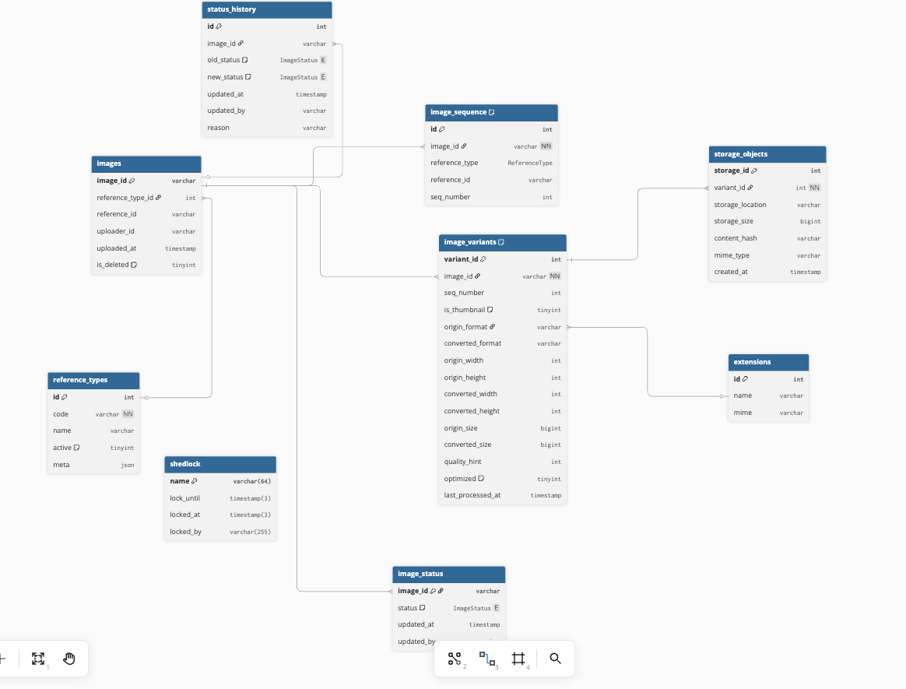
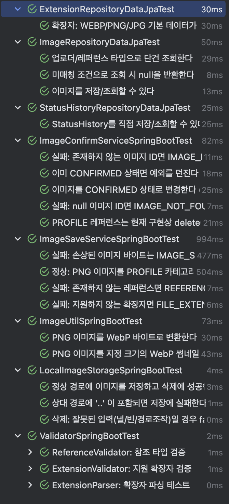

# Image_Server

---

## 이미지 서버 요구사항 

- [x] 이미지 서버는 이미지 저장 및 각 서비스의 이미지 형상관리를 서비스 한다.
- [x] 이미지 서빙의 성능 향상을 위해 각 이미지는 webp파일로 저장하고, 압축률은 디자이너와 협의하여 정한다.
- [x] 이미지크기는 최대 100MB로 제한하며, 이미지 동시저장기능을 제공해야한다.
- [x] 이미지는 1:1 대응, N:1대응을 할 수있다.
- [x] 순서가 있는 카테고리일 경우, 순서를 보장하면서, 이미지의 업데이트를 지원한다.

---

## 이미지 서버 ERD 다이어 그램 

---

## 추가 도출  기능 명세

- [x] 이미지는 80% 손실압축 방식으로 WEBP 파일로 변환한다.
- [x] 이미지의 확장자는 사전에 규정한 확장자 이외에는 받지 않는다.
- [x] 정해진 카테고리의 이미지가 아니면 저장하지 않는다.
- [x] 이미지의 상태 변화 기록을 추척할 수있어야한다.
- [x] nginx를 통해 이미지를 배포할 수 있어야 한다.

----

## 이미지 저장/확정 프로세스

-----

## TEST

