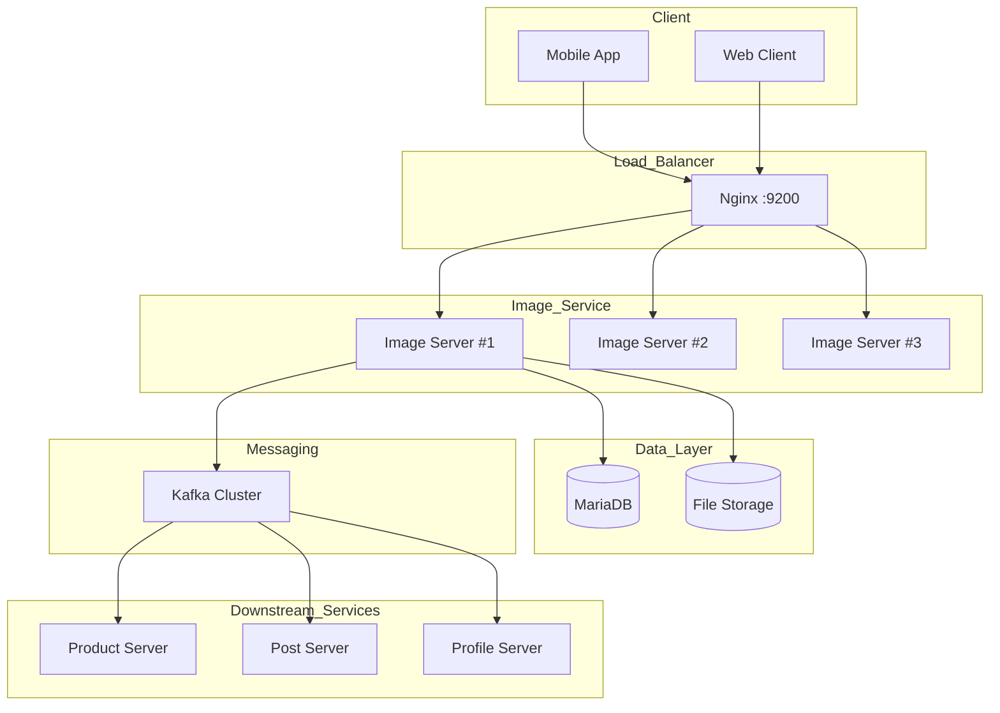
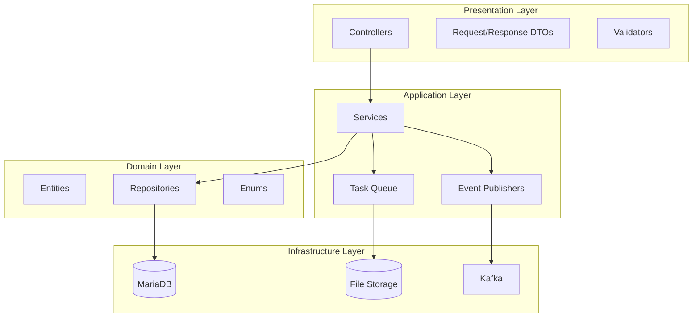
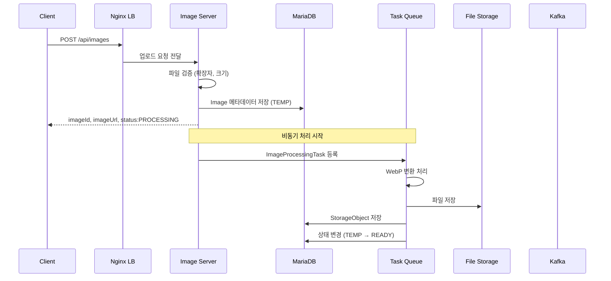
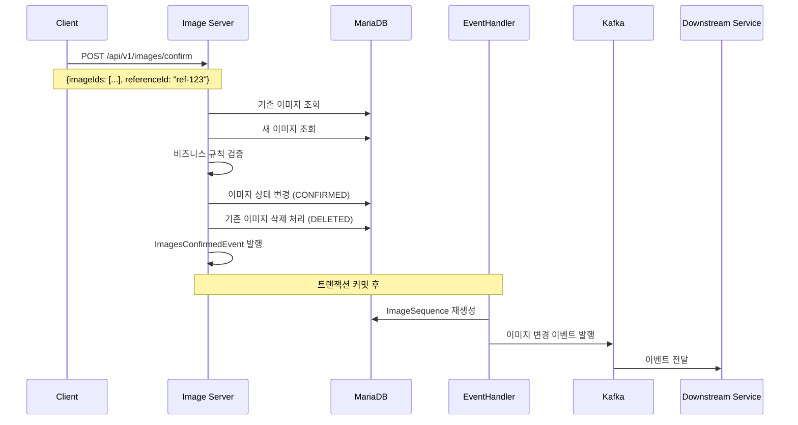
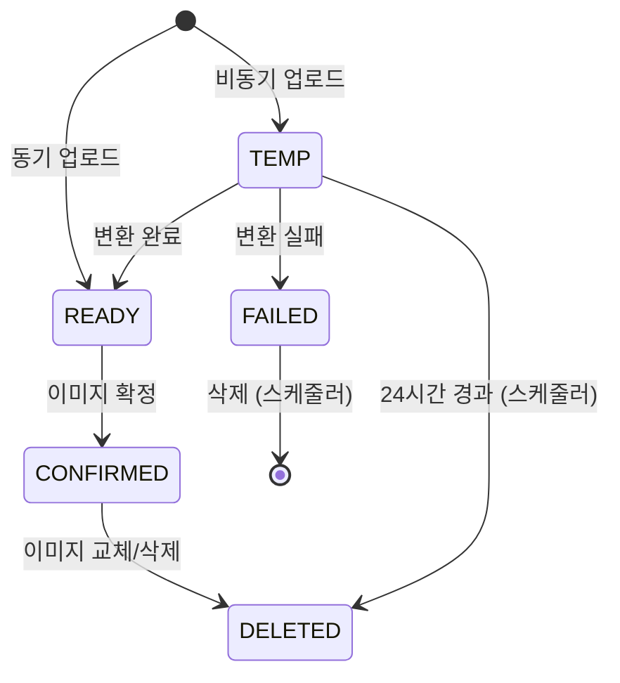
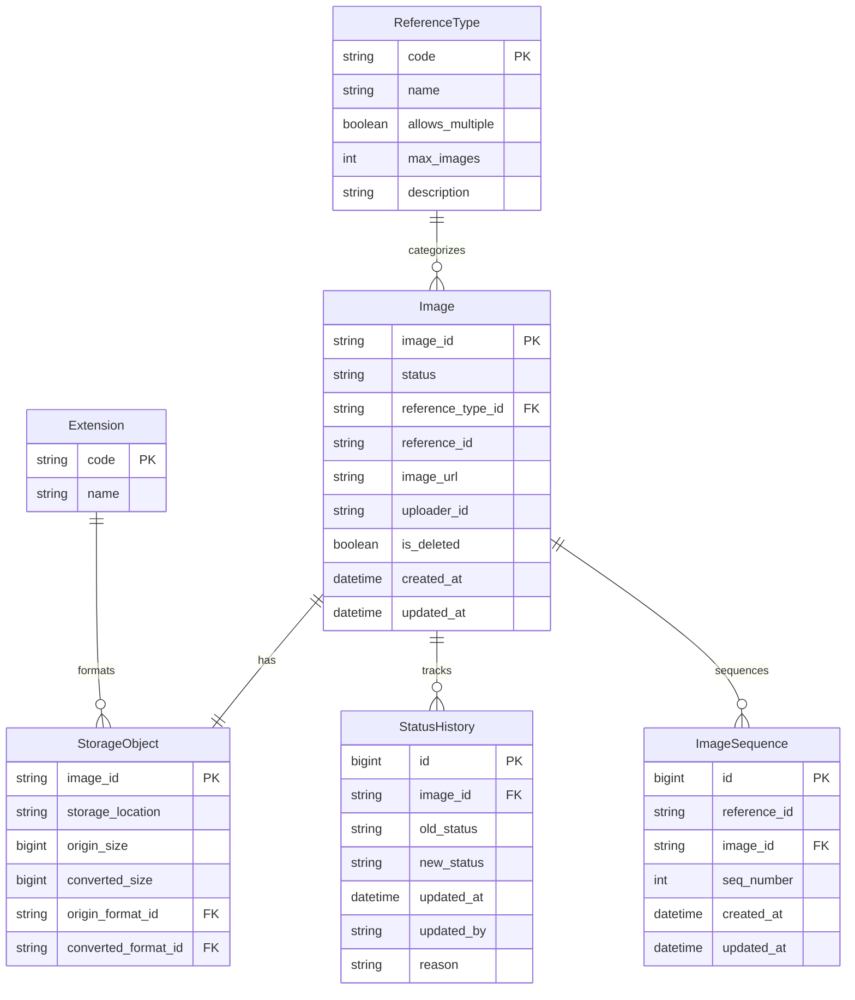
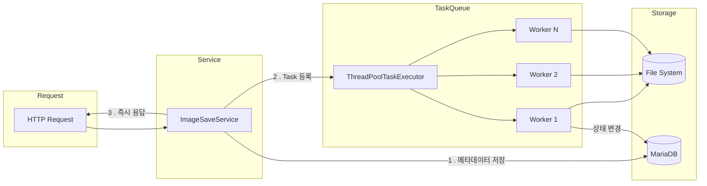

# Image-Server 가이드 문서

## 1. 개요

### 1.1 목적

Image-Server는 플랫폼 내 이미지 업로드, 처리, 확정 워크플로우를 담당하는 마이크로서비스이다.

### 1.2 주요 기능

| 기능        | 설명                                  |
|-----------|-------------------------------------|
| 이미지 업로드   | 단일/다중 이미지 업로드 (동기/비동기)              |
| WebP 변환   | 자동 WebP 포맷 변환 (80% 품질)              |
| 이미지 확정    | TEMP → READY → CONFIRMED 상태 전환      |
| 이미지 순서 관리 | ImageSequence를 통한 다중 이미지 순서 관리      |
| 도메인 이벤트   | 이미지 확정 시 Kafka 이벤트 발행               |
| 참조 타입 관리  | PRODUCT, POST, PROFILE 등 유형별 이미지 규칙 |
| 스케줄링      | 임시/실패 이미지 자동 정리                     |

### 1.3 기술 스택

| 구분               | 기술                         |
|------------------|----------------------------|
| Framework        | Spring Boot 3.5.5          |
| Language         | Java 21 (Eclipse Temurin)  |
| Database         | MariaDB 11.x               |
| Message Broker   | Apache Kafka               |
| Image Processing | Scrimage 4.0.32 + libwebp7 |
| Async Processing | ThreadPoolTaskExecutor     |
| Documentation    | Swagger/OpenAPI 3.0        |

---

## 2. 시스템 아키텍처

### 2.1 전체 구조



### 2.2 레이어 아키텍처



### 2.3 이미지 업로드 흐름 (비동기)



### 2.4 이미지 확정 흐름 (다중)



### 2.5 이미지 상태 전이



---

## 3. 데이터 모델

### 3.1 ERD



### 3.2 테이블 상세

#### reference_types (참조 타입)

| 필드              | 타입           | 필수 | 설명                   |
|-----------------|--------------|----|----------------------|
| code            | VARCHAR(32)  | Y  | PK, 타입 코드            |
| name            | VARCHAR(64)  | Y  | 표시명                  |
| allows_multiple | TINYINT(1)   | Y  | 다중 이미지 허용 여부         |
| max_images      | INT          | N  | 최대 이미지 개수 (null=무제한) |
| description     | VARCHAR(255) | N  | 설명                   |

**초기 데이터:**

| code            | name   | allows_multiple | max_images |
|-----------------|--------|-----------------|------------|
| PRODUCT         | 상품     | true            | 10         |
| POST            | 게시글    | true            | 20         |
| BANNER          | 배너     | true            | null       |
| CATEGORY        | 카테고리   | false           | 1          |
| PROFILE         | 프로필    | false           | 1          |
| USER_BACKGROUND | 사용자 배경 | false           | 1          |

#### extensions (확장자)

| 필드   | 타입          | 필수 | 설명      |
|------|-------------|----|---------|
| code | VARCHAR(16) | Y  | PK, 확장자 |
| name | VARCHAR(64) | Y  | 표시명     |

**지원 형식:** JPG, JPEG, PNG, GIF, WEBP, AVIF, BMP, SVG, MP4, MOV, HEIC, HEIF

#### images (이미지)

| 필드                | 타입           | 필수 | 설명                                      |
|-------------------|--------------|----|-----------------------------------------|
| image_id          | VARCHAR(255) | Y  | PK, UUID                                |
| status            | ENUM         | Y  | TEMP, READY, CONFIRMED, DELETED, FAILED |
| reference_type_id | VARCHAR(32)  | Y  | FK to reference_types.code              |
| reference_id      | VARCHAR(200) | N  | 참조 대상 ID (확정 시 설정)                      |
| image_url         | VARCHAR(500) | Y  | 이미지 접근 URL                              |
| uploader_id       | VARCHAR(255) | N  | 업로더 ID                                  |
| is_deleted        | TINYINT(1)   | Y  | 삭제 플래그                                  |
| created_at        | DATETIME(6)  | N  | 생성 시간                                   |
| updated_at        | DATETIME(6)  | N  | 수정 시간                                   |

#### storage_objects (스토리지 정보)

| 필드                  | 타입            | 필수 | 설명                    |
|---------------------|---------------|----|-----------------------|
| image_id            | VARCHAR(255)  | Y  | PK, FK to images      |
| storage_location    | VARCHAR(1000) | Y  | 실제 저장 경로              |
| origin_size         | BIGINT        | Y  | 원본 파일 크기 (bytes)      |
| converted_size      | BIGINT        | N  | 변환 후 크기 (bytes)       |
| origin_format_id    | VARCHAR(16)   | Y  | FK to extensions.code |
| converted_format_id | VARCHAR(16)   | N  | FK to extensions.code |

#### status_history (상태 이력)

| 필드         | 타입            | 필수 | 설명                 |
|------------|---------------|----|--------------------|
| id         | BIGINT        | Y  | PK, Auto Increment |
| image_id   | VARCHAR(255)  | Y  | FK to images       |
| old_status | ENUM          | Y  | 변경 전 상태            |
| new_status | ENUM          | Y  | 변경 후 상태            |
| updated_at | DATETIME(6)   | Y  | 변경 시각              |
| updated_by | VARCHAR(255)  | N  | 변경 주체              |
| reason     | VARCHAR(1000) | N  | 변경 사유              |

#### image_sequence (이미지 순서)

| 필드           | 타입           | 필수 | 설명                 |
|--------------|--------------|----|--------------------|
| id           | BIGINT       | Y  | PK, Auto Increment |
| reference_id | VARCHAR(255) | Y  | 참조 ID              |
| image_id     | VARCHAR(255) | Y  | FK to images       |
| seq_number   | INT          | Y  | 순서 번호 (0부터)        |
| created_at   | DATETIME(6)  | Y  | 생성 시간              |
| updated_at   | DATETIME(6)  | N  | 수정 시간              |

**인덱스:**
```sql
idx_reference_seq (reference_id, seq_number)
idx_image_id (image_id)
```

**유니크 제약:**

```sql
uk_reference_image (reference_id, image_id)
uk_reference_seq (reference_id, seq_number)
```

---

## 4. API 명세

### 4.1 이미지 업로드

#### 이미지 업로드 (비동기)

```
POST /api/images
```

**Headers**

| 헤더           | 필수 | 설명                  |
|--------------|----|---------------------|
| Content-Type | Y  | multipart/form-data |

**Request (단일)**

| 필드         | 타입            | 필수 | 설명                              |
|------------|---------------|----|---------------------------------|
| file       | MultipartFile | Y  | 업로드할 이미지 파일                     |
| uploaderId | String        | Y  | 업로더 ID                          |
| category   | String        | Y  | 카테고리 (PRODUCT, POST, PROFILE 등) |

**Request (다중)**

| 필드         | 타입                  | 필수 | 설명              |
|------------|---------------------|----|-----------------|
| files      | List<MultipartFile> | Y  | 업로드할 이미지 파일 리스트 |
| uploaderId | String              | Y  | 업로더 ID          |
| category   | String              | Y  | 카테고리            |

**Response (단일)**

```json
{
  "id": "550e8400-e29b-41d4-a716-446655440000",
   "imageUrl": "http://example.com/images/PRODUCT/2025/01/20/550e8400.webp",
   "status": "PROCESSING"
}
```

**Response (다중)**

```json
[
   {
      "id": "550e8400-e29b-41d4-a716-446655440000",
      "imageUrl": "http://example.com/images/PRODUCT/2025/01/20/550e8400.webp",
      "status": "PROCESSING"
   },
   {
      "id": "550e8400-e29b-41d4-a716-446655440001",
      "imageUrl": "http://example.com/images/PRODUCT/2025/01/20/550e8401.webp",
      "status": "PROCESSING"
   }
]
```

**상태 코드**

| 코드  | 설명                    |
|-----|-----------------------|
| 200 | 업로드 성공                |
| 400 | 잘못된 요청 (확장자, 파일 크기 등) |
| 500 | 서버 오류                 |

### 4.2 이미지 확정

#### 단일 이미지 확정

```
POST /api/v1/images/confirm/{referenceId}
```

**Query Parameters**

| 파라미터    | 타입     | 필수 | 설명                         |
|---------|--------|----|----------------------------|
| imageId | String | Y  | 확정할 이미지 ID (빈 문자열 = 전체 삭제) |

**Path Variables**

| 파라미터        | 타입     | 필수 | 설명    |
|-------------|--------|----|-------|
| referenceId | String | Y  | 참조 ID |

**동작:**

1. **단일 이미지 타입 (PROFILE, CATEGORY):**
   - 기존 이미지가 있으면 DELETED 처리
   - 새 이미지 CONFIRMED 처리
   - 즉시 Kafka 이벤트 발행

2. **빈 문자열 imageId:**
   - 해당 referenceId의 모든 이미지 삭제
   - 삭제 이벤트 발행

**Response**

```
200 OK (No Content)
```

#### 다중 이미지 확정 (배치)

```
POST /api/v1/images/confirm
```

**Request**

```json
{
  "imageIds": ["id1", "id2", "id3"],
  "referenceId": "ref-456"
}
```

| 필드          | 타입           | 필수 | 설명                            |
|-------------|--------------|----|-------------------------------|
| imageIds    | List<String> | Y  | 확정할 이미지 ID 리스트 (빈 배열 = 전체 삭제) |
| referenceId | String       | Y  | 참조 ID                         |

**동작:**

1. **다중 이미지 타입 (PRODUCT, POST):**
   - 전달된 이미지들 CONFIRMED 처리
   - 기존 이미지 중 목록에 없는 것은 DELETED 처리
   - ImageSequence 자동 생성 (순서 유지)
   - 도메인 이벤트 발행 (ImagesConfirmedEvent)
   - 트랜잭션 커밋 후 Kafka 이벤트 발행

2. **빈 배열 imageIds:**
   - 해당 referenceId의 모든 이미지 삭제
   - ImageSequence 삭제
   - 빈 배열 이벤트 발행

**Response**

```
200 OK (No Content)
```

### 4.3 Enums 조회

#### 지원 확장자 조회

```
GET /api/v1/enums/extensions
```

**Response**

```json
{
  "JPG": "JPEG Image",
  "PNG": "Portable Network Graphics",
  "WEBP": "WebP Image",
   "GIF": "Graphics Interchange Format",
   "HEIC": "High Efficiency Image Container"
}
```

#### 참조 타입 조회

```
GET /api/v1/enums/referenceType
```

**Response**

```json
{
  "PRODUCT": "상품",
  "POST": "게시글",
  "PROFILE": "프로필",
   "BANNER": "배너",
   "CATEGORY": "카테고리",
   "USER_BACKGROUND": "사용자 배경"
}
```

### 4.4 헬스 체크

#### Actuator 헬스 체크

```
GET /actuator/health
```

**Response**

```json
{
  "status": "UP",
  "components": {
    "db": {
      "status": "UP",
      "details": {
        "database": "MariaDB",
        "validationQuery": "isValid()"
      }
    },
    "diskSpace": {
      "status": "UP"
    },
    "kafka": {
      "status": "UP"
    },
    "fileSystem": {
      "status": "UP",
      "details": {
        "baseDir": "/uploads",
        "writable": true
      }
    }
  }
}
```

#### 심플 헬스 체크

```
GET /health
```

**Response**

```
Server is up
```

---

## 5. 이벤트 명세

### 5.1 Kafka Topics

| Topic                  | Producer     | Consumer        | 설명              |
|------------------------|--------------|-----------------|-----------------|
| product-image-changed  | Image Server | Product Server  | 상품 이미지 변경 이벤트   |
| post-image-changed     | Image Server | Post Server     | 게시글 이미지 변경 이벤트  |
| profile-image-changed  | Image Server | Profile Server  | 프로필 이미지 변경 이벤트  |
| banner-image-changed   | Image Server | Banner Server   | 배너 이미지 변경 이벤트   |
| category-image-changed | Image Server | Category Server | 카테고리 이미지 변경 이벤트 |

**Topic 명명 규칙:** `{reference-type-lowercase}-image-changed`

### 5.2 이벤트 페이로드

#### 단일 이미지 변경 (ImageChangeEvent)

```json
{
   "eventId": "evt-uuid-1234",
   "eventType": "IMAGE_CHANGED",
   "timestamp": "2025-01-20T10:00:00Z",
   "payload": {
      "referenceId": "product-123",
      "imageId": "550e8400-e29b-41d4-a716-446655440000",
      "imageUrl": "http://example.com/images/PROFILE/2025/01/20/550e8400.webp"
   }
}
```

#### 다중 이미지 변경 (ImagesChangeEventWrapper)

```json
{
   "eventId": "evt-uuid-2345",
   "eventType": "IMAGES_CHANGED",
   "timestamp": "2025-01-20T10:01:00Z",
   "payload": {
      "referenceId": "product-456",
      "images": [
         {
            "imageId": "id-1",
            "imageUrl": "http://example.com/images/PRODUCT/2025/01/20/id1.webp",
            "referenceId": "product-456",
            "seqNumber": 0
         },
         {
            "imageId": "id-2",
            "imageUrl": "http://example.com/images/PRODUCT/2025/01/20/id2.webp",
            "referenceId": "product-456",
            "seqNumber": 1
         }
      ]
   }
}
```

#### 이미지 전체 삭제 (빈 배열)

```json
{
   "eventId": "evt-uuid-3456",
   "eventType": "IMAGES_DELETED",
   "timestamp": "2025-01-20T11:00:00Z",
   "payload": {
      "referenceId": "product-789",
      "images": []
   }
}
```

---

## 6. 비즈니스 규칙

### 6.1 참조 타입별 규칙

| 참조 타입           | 다중 허용 | 최대 개수 | 확정 방식      | 이벤트 타입            |
|-----------------|-------|-------|------------|-------------------|
| PRODUCT         | O     | 10    | 배치 (순서 관리) | ImagesChangeEvent |
| POST            | O     | 20    | 배치 (순서 관리) | ImagesChangeEvent |
| BANNER          | O     | 무제한   | 배치 (순서 관리) | ImagesChangeEvent |
| PROFILE         | X     | 1     | 단일 (교체)    | ImageChangeEvent  |
| CATEGORY        | X     | 1     | 단일 (교체)    | ImageChangeEvent  |
| USER_BACKGROUND | X     | 1     | 단일 (교체)    | ImageChangeEvent  |

### 6.2 이미지 상태 규칙

| 상태        | 설명         | 확정 가능 | 전이 가능 상태               |
|-----------|------------|-------|------------------------|
| TEMP      | 비동기 업로드 직후 | X     | READY, FAILED, DELETED |
| READY     | 변환 완료      | O     | CONFIRMED, DELETED     |
| CONFIRMED | 확정 완료      | -     | DELETED                |
| DELETED   | 삭제됨        | X     | -                      |
| FAILED    | 변환 실패      | X     | (스케줄러에 의해 삭제)          |

### 6.3 확정 규칙

| 규칙                  | 설명                                   |
|---------------------|--------------------------------------|
| TEMP 상태 확정 시도       | `IMAGE_PROCESSING_IN_PROGRESS` 에러 반환 |
| FAILED 상태 확정 시도     | `IMAGE_PROCESSING_FAILED` 에러 반환      |
| 단일 타입에 다중 이미지 확정 시도 | `NOT_ALLOWED_MULTIPLE_IMAGES` 에러 반환  |
| 최대 개수 초과 시          | `IMAGE_COUNT_EXCEEDED` 에러 반환         |

### 6.4 WebP 변환 규칙

| 규칙            | 설명                         |
|---------------|----------------------------|
| 변환 품질         | 80% (0.8f)                 |
| 변환 실패 시 폴백    | 원본 포맷 그대로 저장               |
| Rosetta 에러 처리 | 원본 저장 (M1 Mac 호환성)         |
| 지원 입력 포맷      | JPG, PNG, GIF, BMP, HEIC 등 |

### 6.5 파일 저장 규칙

| 규칙       | 설명                                         |
|----------|--------------------------------------------|
| 저장 경로 패턴 | `/{CATEGORY}/{YYYY}/{MM}/{DD}/{uuid}.webp` |
| 파일명      | UUID v4                                    |
| 최대 파일 크기 | 10MB (단일), 100MB (전체 요청)                   |

---

## 7. 비동기 처리

### 7.1 Task Queue 아키텍처



### 7.2 ThreadPoolTaskExecutor 설정

| 설정               | 값                | 설명                   |
|------------------|------------------|----------------------|
| corePoolSize     | 10               | 기본 워커 스레드 수          |
| maxPoolSize      | 20               | 최대 워커 스레드 수          |
| queueCapacity    | 500              | 대기 큐 용량              |
| threadNamePrefix | `image-worker-`  | 스레드 이름 접두사           |
| keepAliveSeconds | 60               | 유휴 스레드 유지 시간         |
| rejectedPolicy   | CallerRunsPolicy | 큐 초과 시 호출 스레드가 직접 처리 |

### 7.3 성능 비교

| 항목    | 동기 방식    | 비동기 방식       |
|-------|----------|--------------|
| 응답 시간 | 변환 완료 후  | 즉시 (< 100ms) |
| 처리량   | ~28개/초   | ~208개/초      |
| 성능 향상 | -        | **약 7.5배**   |
| 상태    | 즉시 READY | TEMP → READY |

---

## 8. 인덱스 설계

### 8.1 images 테이블

```sql
-- 기본 키
PRIMARY
KEY
   (image_id)

-- 참조 ID로 이미지 조회
CREATE INDEX idx_images_reference_id ON images (reference_id);

-- 상태별 이미지 필터링
CREATE INDEX idx_images_status ON images (status);

-- 스케줄러용: 상태 + 생성일 복합 인덱스
CREATE INDEX idx_images_status_created ON images (status, created_at);

-- 업로더별 이미지 조회
CREATE INDEX idx_images_uploader_id ON images (uploader_id);
```

### 8.2 image_sequence 테이블

```sql
-- 기본 키
PRIMARY
KEY
   (id)

-- 참조 ID + 순서로 조회 (가장 빈번)
CREATE INDEX idx_reference_seq ON image_sequence (reference_id, seq_number);

-- 이미지 ID로 조회
CREATE INDEX idx_image_id ON image_sequence (image_id);

-- 유니크 제약 (중복 방지)
CREATE UNIQUE INDEX uk_reference_image ON image_sequence (reference_id, image_id);
CREATE UNIQUE INDEX uk_reference_seq ON image_sequence (reference_id, seq_number);
```

### 8.3 status_history 테이블

```sql
-- 이미지별 이력 조회
CREATE INDEX idx_history_image_id ON status_history (image_id);

-- 변경 시간 기준 조회
CREATE INDEX idx_history_updated_at ON status_history (updated_at);
```

---

## 9. 에러 코드

### 9.1 이미지 관련 에러

| 코드                          | HTTP Status | 설명             |
|-----------------------------|-------------|----------------|
| IMAGE_NOT_FOUND             | 404         | 이미지를 찾을 수 없음   |
| IMAGE_SAVE_FAILED           | 500         | 이미지 저장 실패      |
| IMAGE_ALREADY_CONFIRMED     | 400         | 이미 확정된 이미지     |
| IMAGE_COUNT_EXCEEDED        | 400         | 최대 이미지 개수 초과   |
| NOT_ALLOWED_MULTIPLE_IMAGES | 400         | 다중 이미지 허용되지 않음 |

### 9.2 비동기 처리 관련 에러

| 코드                           | HTTP Status | 설명                  |
|------------------------------|-------------|---------------------|
| IMAGE_PROCESSING_IN_PROGRESS | 409         | 이미지 처리 중 (잠시 후 재시도) |
| IMAGE_PROCESSING_FAILED      | 500         | 이미지 처리 실패 (재업로드 필요) |

### 9.3 파일 관련 에러

| 코드                       | HTTP Status | 설명           |
|--------------------------|-------------|--------------|
| INVALID_FILE_NAME        | 400         | 유효하지 않은 파일명  |
| INVALID_FILE_EXTENSION   | 400         | 지원하지 않는 확장자  |
| FILE_EXTENSION_NOT_FOUND | 400         | 확장자를 찾을 수 없음 |
| IOException              | 500         | 파일 입출력 오류    |

### 9.4 참조 타입 관련 에러

| 코드                       | HTTP Status | 설명             |
|--------------------------|-------------|----------------|
| INVALID_REFERENCE        | 400         | 유효하지 않은 참조     |
| REFERENCE_TYPE_NOT_FOUND | 400         | 참조 타입을 찾을 수 없음 |
| INVALID_EXTENSION        | 400         | 유효하지 않은 확장자    |

### 9.5 시퀀스 관련 에러

| 코드                            | HTTP Status | 설명              |
|-------------------------------|-------------|-----------------|
| INVALID_IMAGE_SEQUENCE        | 400         | 유효하지 않은 이미지 순서  |
| IMAGE_SEQUENCE_NOT_FOUND      | 404         | 이미지 순서를 찾을 수 없음 |
| IMAGE_SEQUENCE_ALREADY_EXISTS | 400         | 이미지 순서가 이미 존재함  |

---

## 10. 환경 설정

### 10.1 환경 변수

```bash
# Database
DATABASE_HOST=localhost
DATABASE_PORT=3306
DATABASE_NAME=images
DATABASE_USER_NAME=images
DATABASE_PASSWORD=your_password

# Redis (ShedLock용)
REDIS_HOST=localhost
REDIS_PORT=6379

# Kafka
KAFKA_URL1=localhost:9092
KAFKA_URL2=localhost:9093
KAFKA_URL3=localhost:9094

# Image Storage
BASE_URL=http://localhost:9200/images/

# Spring Profile
SPRING_PROFILES_ACTIVE=prod
```

### 10.2 application-prod.yaml

```yaml
server:
   port: 8080

management:
   endpoints:
      web:
         exposure:
            include: health,info
   endpoint:
      health:
         show-details: when-authorized
         probes:
            enabled: true

spring:
   kafka:
      bootstrap-servers: ${KAFKA_URL1},${KAFKA_URL2},${KAFKA_URL3}
      producer:
         retries: 3
         batch-size: 16384
         buffer-memory: 33554432
         key-serializer: org.apache.kafka.common.serialization.StringSerializer
         value-serializer: org.apache.kafka.common.serialization.StringSerializer

   datasource:
      url: jdbc:mariadb://${DATABASE_HOST}:${DATABASE_PORT}/${DATABASE_NAME}
      username: ${DATABASE_USER_NAME}
      password: ${DATABASE_PASSWORD}
      driver-class-name: org.mariadb.jdbc.Driver

  jpa:
    hibernate:
       ddl-auto: none
    properties:
       hibernate:
          dialect: org.hibernate.dialect.MariaDBDialect

   servlet:
      multipart:
         max-file-size: 10MB
         max-request-size: 100MB

images:
  upload:
    dir: /uploads
  base-url: ${BASE_URL}
```

### 10.3 Docker 배포

#### Dockerfile

```dockerfile
FROM eclipse-temurin:21-jre-jammy

WORKDIR /app

# 런타임에 필요한 네이티브 라이브러리 설치 (libwebp)
RUN apt-get update && apt-get install -y --no-install-recommends \
    libwebp7 ca-certificates curl \
 && rm -rf /var/lib/apt/lists/*

COPY build/libs/*.jar /app/app.jar

EXPOSE 8080

HEALTHCHECK --interval=30s --timeout=10s --retries=3 \
  CMD curl -f http://localhost:8080/health || exit 1

ENTRYPOINT ["java", "-jar", "/app/app.jar"]
```

#### 멀티 아키텍처 빌드

```bash
# buildx 사용
docker buildx build \
  --platform linux/amd64,linux/arm64 \
  -t ddingsh9/image-server:latest \
  --push .
```

### 10.4 Docker Compose

```yaml
version: '3.7'

services:
   nginx:
      image: nginx:alpine
      container_name: nginx-image
      ports:
         - "9200:80"
      volumes:
         - ./nginx/conf:/etc/nginx/conf.d:ro
         - images-data:/usr/share/nginx/images:ro
      depends_on:
         - image-server-1
         - image-server-2
         - image-server-3
      networks:
         - image-network

   image-server-1:
      image: ddingsh9/image-server:latest
      container_name: image-server-1
      env_file:
         - .env.prod
    volumes:
      - images-data:/uploads
    networks:
      - image-network
      - infra-network
    healthcheck:
       test: [ "CMD", "curl", "-f", "http://localhost:8080/health" ]
       interval: 15s
       timeout: 5s
      retries: 3

   image-server-2:
      image: ddingsh9/image-server:latest
      container_name: image-server-2
      env_file:
         - .env.prod
    volumes:
       - images-data:/uploads
      networks:
         - image-network
         - infra-network
      healthcheck:
         test: [ "CMD", "curl", "-f", "http://localhost:8080/health" ]
         interval: 15s
         timeout: 5s
         retries: 3

   image-server-3:
      image: ddingsh9/image-server:latest
      container_name: image-server-3
      env_file:
         - .env.prod
      volumes:
         - images-data:/uploads
      networks:
         - image-network
         - infra-network
      healthcheck:
         test: [ "CMD", "curl", "-f", "http://localhost:8080/health" ]
         interval: 15s
         timeout: 5s
         retries: 3

networks:
  image-network:
     driver: bridge
  infra-network:
    external: true

volumes:
   images-data:
      driver: local
```

### 10.5 Nginx 설정

```nginx
upstream image_servers {
    server image-server-1:8080;
    server image-server-2:8080;
    server image-server-3:8080;
}

server {
    listen 80;
    server_name localhost;

    client_max_body_size 100M;

    location /api/ {
        proxy_pass http://image_servers;
        proxy_set_header Host $host;
        proxy_set_header X-Real-IP $remote_addr;
        proxy_set_header X-Forwarded-For $proxy_add_x_forwarded_for;
        proxy_set_header X-Forwarded-Proto $scheme;
    }

    location /images/ {
        alias /usr/share/nginx/images/;
        expires 30d;
        add_header Cache-Control "public, immutable";
    }

    location /health {
        proxy_pass http://image_servers/health;
        access_log off;
    }

    location /actuator/health {
        proxy_pass http://image_servers/actuator/health;
        access_log off;
    }
}
```

---

## 11. 스케줄링

### 11.1 스케줄 작업

| 작업          | 크론 표현식         | 설명                             |
|-------------|----------------|--------------------------------|
| 실패 이미지 정리   | `0 0 3 * * *`  | 24시간 이상 경과 FAILED 이미지 삭제       |
| 오래된 TEMP 정리 | `0 0 10 * * *` | 24시간 이상 경과 TEMP 이미지 삭제         |
| 캐시 새로고침     | `0 30 0 * * *` | Extension, ReferenceType 캐시 갱신 |

### 11.2 FailedImageCleanupScheduler

```java

@Scheduled(cron = "0 0 3 * * *")  // 매일 새벽 3시
@Transactional
public void cleanupFailedImages() {
   // 24시간 이상 경과한 FAILED 이미지 삭제
   LocalDateTime threshold = LocalDateTime.now().minusDays(1);
   List<Image> failedImages = imageRepository
           .findByStatusAndCreatedAtBefore(ImageStatus.FAILED, threshold);

   for (Image image : failedImages) {
      // 파일 삭제
      imageStorage.delete(image.getStorageObject().getStorageLocation());
      // DB 삭제
      imageRepository.delete(image);
   }
}

@Scheduled(cron = "0 0 10 * * *")  // 매일 오전 10시
@Transactional
public void cleanupStaleTempImages() {
   // 24시간 이상 TEMP 상태인 이미지 삭제
   LocalDateTime threshold = LocalDateTime.now().minusDays(1);
   List<Image> staleImages = imageRepository
           .findByStatusAndCreatedAtBefore(ImageStatus.TEMP, threshold);

   for (Image image : staleImages) {
      imageStorage.delete(image.getStorageObject().getStorageLocation());
      imageRepository.delete(image);
   }
}
```

---

## 12. 테스트

### 12.1 테스트 커버리지

```
총 테스트 수: 203+
성공률: 100%
```

### 12.2 테스트 구조

| 레이어         | 테스트 수 | 파일 위치                       |
|-------------|-------|-----------------------------|
| Validator   | 100+  | `util/validator/*Test.java` |
| Entity      | 25    | `entity/*Test.java`         |
| DTO         | 10    | `dto/*Test.java`            |
| Controller  | 33    | `controller/*Test.java`     |
| Service     | 20    | `service/*Test.java`        |
| Repository  | 9     | `repository/*Test.java`     |
| Performance | 6     | `performance/*Test.java`    |

### 12.3 테스트 실행

```bash
# 전체 테스트 실행
./gradlew test

# 특정 레이어 테스트
./gradlew test --tests "*controller*"
./gradlew test --tests "*service*"
./gradlew test --tests "*performance*"

# 테스트 리포트 생성
./gradlew test jacocoTestReport

# 빌드 with 테스트
./gradlew clean build
```

---

## 13. 프로젝트 구조

```
src/main/java/com/teambind/image_server/
├── config/
│   ├── AsyncConfig.java                # 비동기 Task Queue 설정
│   ├── InitialSetup.java               # 인메모리 캐시 초기화
│   ├── KafkaRetryConfig.java           # Kafka 재시도 설정
│   └── SchedulingConfig.java           # 스케줄러 설정
│
├── controller/
│   ├── ImageSaveController.java        # 이미지 업로드 API
│   ├── ImageConfirmController.java     # 이미지 확정 API
│   ├── EnumsController.java            # Enum 조회 API
│   └── HealthController.java           # 헬스 체크 API
│
├── service/
│   ├── ImageSaveService.java           # 동기/비동기 저장 로직
│   ├── ImageConfirmService.java        # 확정 비즈니스 로직
│   ├── ImageSequenceService.java       # 순서 관리 로직
│   ├── ImageProcessingTaskQueue.java   # Task Queue 관리
│   └── ScheduleService.java            # 스케줄 관련 로직
│
├── entity/
│   ├── Image.java                      # 이미지 엔티티
│   ├── ImageSequence.java              # 순서 엔티티
│   ├── ReferenceType.java              # 참조 타입 엔티티
│   ├── Extension.java                  # 확장자 엔티티
│   ├── StorageObject.java              # 스토리지 정보 엔티티
│   └── StatusHistory.java              # 상태 이력 엔티티
│
├── repository/
│   ├── ImageRepository.java
│   ├── ImageSequenceRepository.java
│   ├── ReferenceTypeRepository.java
│   ├── ExtensionRepository.java
│   ├── StorageObjectRepository.java
│   └── StatusHistoryRepository.java
│
├── event/
│   ├── events/
│   │   ├── ImagesConfirmedEvent.java       # 도메인 이벤트
│   │   ├── ImageChangeEvent.java           # 단일 변경 이벤트
│   │   ├── SequentialImageChangeEvent.java # 순차 이벤트
│   │   └── ImagesChangeEventWrapper.java   # 다중 변경 래퍼
│   ├── handler/
│   │   └── ImageSequenceEventHandler.java  # 이벤트 핸들러
│   ├── publish/
│   │   └── ImageChangeEventPublisher.java  # Kafka 발행
│   └── EventPublisher.java                 # 이벤트 발행 인터페이스
│
├── scheduler/
│   └── FailedImageCleanupScheduler.java    # 실패 이미지 정리
│
├── task/
│   └── ImageProcessingTask.java            # 비동기 처리 태스크
│
├── enums/
│   └── ImageStatus.java                    # 상태 Enum
│
├── exception/
│   ├── ErrorCode.java                      # 에러 코드 정의
│   ├── CustomException.java                # 커스텀 예외
│   ├── ErrorResponse.java                  # 에러 응답 DTO
│   └── GlobalExceptionHandler.java         # 전역 예외 핸들러
│
├── dto/
│   └── request/
│       ├── ImageUploadRequest.java         # 업로드 요청 DTO
│       ├── ImageConfirmRequest.java        # 단일 확정 요청
│       └── ImageBatchConfirmRequest.java   # 배치 확정 요청
│
├── util/
│   ├── convertor/
│   │   └── ImageUtil.java                  # WebP 변환 유틸
│   ├── helper/
│   │   ├── UrlHelper.java                  # URL 생성 헬퍼
│   │   └── ExtensionParser.java            # 확장자 파싱
│   ├── store/
│   │   └── LocalImageStorage.java          # 로컬 파일 저장소
│   └── validator/
│       ├── ReferenceTypeValidator.java     # 참조 타입 검증
│       ├── ExtensionValidator.java         # 확장자 검증
│       └── ImageFileValidator.java         # 파일 검증
│
├── health/
│   ├── KafkaHealthIndicator.java           # Kafka 헬스 체크
│   └── FileSystemHealthIndicator.java      # 파일시스템 헬스 체크
│
└── ImageServerApplication.java             # 메인 애플리케이션
```

---

## 14. 참고 사항

### 14.1 도메인 이벤트 패턴

Image Server는 도메인 이벤트 패턴을 사용하여 이미지 확정 후 처리를 수행합니다.

```java
// 1. 이미지 확정 서비스에서 도메인 이벤트 발행
applicationEventPublisher.publishEvent(
    new ImagesConfirmedEvent(referenceId, confirmedImages, referenceTypeCode)
);

// 2. 이벤트 핸들러에서 트랜잭션 커밋 후 처리
@TransactionalEventListener(phase = TransactionPhase.AFTER_COMMIT)
public void handleImagesConfirmed(ImagesConfirmedEvent event) {
   // ImageSequence 재생성
   List<ImageSequence> sequences = imageSequenceService.recreateSequences(...);
   // Kafka 이벤트 발행
   eventPublisher.imagesChangeEvent(sequences);
}
```

**장점:**

- DB 트랜잭션과 Kafka 발행 분리
- 트랜잭션 실패 시 Kafka 이벤트 발행 방지
- Kafka 발행 실패가 DB 트랜잭션에 영향 없음

### 14.2 인메모리 캐시 전략

서버 시작 시 자주 조회되는 데이터를 인메모리에 캐싱합니다.

```java
// InitialSetup.java
public static final Map<String, ReferenceType> ALL_REFERENCE_TYPE_MAP = new ConcurrentHashMap<>();
public static final Map<String, Extension> EXTENSION_MAP = new ConcurrentHashMap<>();

@PostConstruct
public void init() {
   loadData();
}

@Scheduled(cron = "0 30 0 * * *")  // 매일 00:30 갱신
public void loadData() {
   loadExtension();
   loadReferenceType();
}
```

### 14.3 파일 저장 경로 규칙

```
/uploads/{CATEGORY}/{YYYY}/{MM}/{DD}/{uuid}.webp

예시:
/uploads/PRODUCT/2025/01/20/550e8400-e29b-41d4-a716-446655440000.webp
/uploads/PROFILE/2025/01/20/660f9500-e29b-41d4-a716-556766550111.webp
```

### 14.4 비동기 처리 흐름

```
1. HTTP 요청 수신
2. 메타데이터 DB 저장 (status: TEMP)
3. 즉시 응답 반환 (id, imageUrl, status: PROCESSING)
4. Task Queue에 처리 작업 등록
5. 워커 스레드가 WebP 변환 수행
6. StorageObject 저장
7. 상태 변경 (TEMP → READY)
8. 클라이언트가 확정 API 호출 가능
```

---

## 15. 성능 최적화

### 15.1 최적화 기법

| 기법                 | 적용 위치               | 효과              |
|--------------------|---------------------|-----------------|
| 비동기 Task Queue     | ImageSaveService    | 응답 시간 7배 단축     |
| 인메모리 캐시            | InitialSetup        | DB 조회 50% 감소    |
| preloadedImage 재사용 | ImageConfirmService | 중복 조회 방지        |
| 배치 처리              | 다중 이미지 확정           | 트랜잭션 최적화        |
| WebP 변환            | ImageUtil           | 파일 크기 60-80% 감소 |

### 15.2 권장 사용 시나리오

| 시나리오           | 권장 방식 | 이유                  |
|----------------|-------|---------------------|
| 소량 업로드 (1~10개) | 비동기   | 빠른 응답               |
| 대량 업로드 (50개+)  | 비동기   | 스레드 풀 활용, 7배 성능 향상  |
| 즉시 변환 필요       | 동기    | 변환 완료 후 READY 상태 보장 |
| 배치 작업          | 비동기   | 백그라운드 처리로 효율성 극대화   |

---

**버전**: 2.0.1
**최종 업데이트**: 2025-01-20
**팀**: TeamBind Development Team
